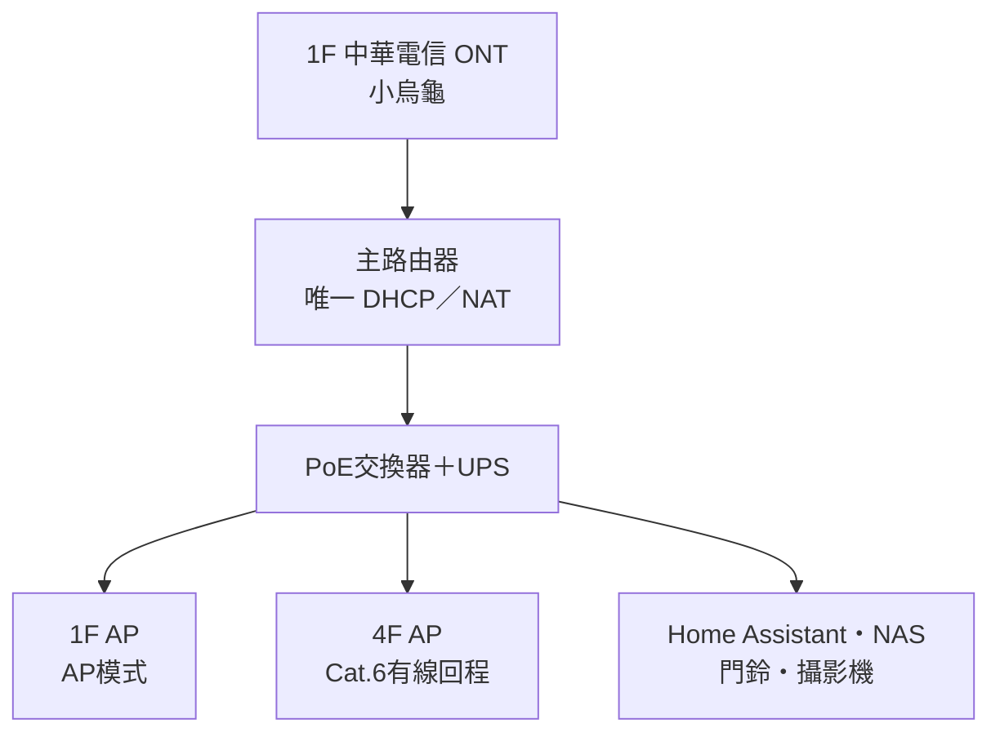

# 智慧家庭需求與施工規劃

> 專案：居家整修規劃  
> 地點：新北市三重區  
> 適用範圍：1F、4F及全屋網路骨幹  
> 文件狀態：規劃中  
> 最後更新：2026-09-22

## 1. 設計原則

1. 採用 **Home Assistant（HA）作為本地自動化中樞**。
2. HA透過 **HomeKit Bridge** 將日常裝置提供給Apple Home，作為家人主要操作介面。
3. 即使HA、網路或智慧模組故障，主要照明、熱水器及鐵捲門仍需保有實體控制。
4. 既有SONOFF Wi-Fi裝置可保留；新增感測器、按鍵及牆內模組優先考慮Zigbee。
5. 高負載設備不可由一般智慧開關直接承載，應透過接觸器或原設備控制端操作。
6. 裝修期間優先完成中性線、深底盒、網路線、供電、控制線、電箱空間及維修空間預留；智慧設備可分期安裝。
7. 安全相關裝置不可僅依賴雲端或App，必須保留本地手動備援。

## 2. 系統架構

### 2.1 網路拓樸

### 2.2 網路需求

- 中華電信線路由1F接入光纖數據機。
- 主路由器放在1F，負責PPPoE、DHCP、NAT、防火牆及內網管理。
- 1F與4F AP均使用AP／Bridge模式，不另外啟用DHCP或NAT。
- 1F與4F AP使用相同SSID、密碼及安全設定，無線頻道錯開。
- 4F AP使用Cat.6有線回程，不以無線Mesh作主要回程。
- 全屋設備維持在同一區域網路，讓HA、Apple Home及各裝置能互相發現與控制。
- 1F到4F建議拉設：
  - Cat.6正式線 × 1：供4F AP。
  - Cat.6備援線 × 1：供4F交換器、NAS、電視牆或故障備援。
  - 空管＋引線 × 1：供日後升級或維修。
- 網路線採純銅Cat.6，不接受CCA銅包鋁。
- 所有線路採星狀回到1F機櫃／弱電箱，兩端標號並完成測試。
- 強電與弱電不得共管。
- 路由器、PoE交換器、HA主機及NAS接UPS。

### 2.3 網路端點預留

| 位置 | 建議數量 | 用途 |
|---|---:|---|
| 1F AP | Cat.6 × 1 | PoE有線AP |
| 4F AP | Cat.6 × 1 | PoE有線AP |
| 客廳電視牆 | Cat.6 × 2 | 電視、播放器、遊戲機 |
| 1F大門 | Cat.6 × 2 | PoE門鈴及攝影機／備援 |
| 房間工作桌 | 每處Cat.6 × 2 | 電腦及其他設備 |
| NAS／HA位置 | Cat.6 × 2～4 | NAS、HA、管理及未來擴充 |
| 1F鐵捲門控制箱 | Cat.6 × 1或獨立控制線／空管 | 控制、狀態感測及未來維修 |

### 2.4 Zigbee網路

- 單一Wi-Fi區域網路不會自動延伸Zigbee訊號。
- Zigbee協調器不可直接放在金屬機櫃內或緊鄰USB 3.0設備。
- 協調器應使用USB延長線遠離主機、NAS及金屬機櫃。
- 由於1F與4F相隔多層樓板，優先評估：
  1. 將網路型／PoE Zigbee協調器放在2F或3F樓梯附近；或
  2. 在中間樓層配置常時供電的Zigbee Router裝置。
- 原則上維持單一Zigbee網路，不優先建立兩套獨立Mesh。

## 3. Home Assistant與Apple Home

- HA負責跨品牌整合、自動化、狀態判斷及通知。
- Apple Home作為家人日常操作介面。
- 現有HomeKit Bridge約有27個配件。
- 目前缺少Apple家庭中樞；規劃增加HomePod mini或Apple TV 4K，以支援Apple Home外網控制及家庭成員遠端存取。
- HA內的重要裝置應優先採本地控制，避免單純依賴廠商雲端。

## 4. 照明控制

### 4.1 已確認需求

- 牆面只需要開／關，不需要牆上直接調光。
- 主要燈具必須保留實體牆上控制。
- SONOFF M5可作為有線實體智慧開關。
- SONOFF R5可作為沙發旁、床頭或其他位置的無線情境按鍵。
- R5不需要底盒、火線或中性線，不可作為主要照明唯一控制方式。
- 一般崁燈可由單一智慧開關並聯控制同一燈區。
- 客廳HotaluX AURA、Yeelight或其他需遙控調光／調色的智慧燈具應保持常時供電。

### 4.2 施工預留

- 所有牆面開關盒統一預留：
  - L火線
  - N中性線
  - Load燈具回線
  - PE接地線（依設備與現場需求）
- 開關底盒深度至少55 mm，優先60 mm以上。
- 燈具端保留常時L／N／PE。
- 如未來可能拆分燈區，預留額外回路或控制線。
- 智慧吸頂燈的牆面開關作維修斷電用途，平時保持供電；日常以原廠遙控器、R5、HA或Apple Home操作。
- 浴室220V暖風機維持獨立專用迴路，與110V照明分開。

### 4.3 照明自動化原則

- 自動化只疊加在實體操作之上。
- 使用者手動開啟後，自動化不得立即誤關。
- 夜間情境以低亮度或氣氛燈優先。
- 電視播放時避免自動開啟高亮度主燈。
- 無人關燈應設定合理延遲，不以單次感測消失立即關閉。

## 5. 感測器規劃

### 5.1 客餐廳

採用Aqara FP2或同類毫米波存在感測器，規劃以下區域：

- 玄關通道區
- 沙發區
- 餐桌區
- 往廚房通道區

施工與安裝需求：

- 牆面約1.4～1.8 m高、視野不受櫃體遮擋的位置。
- 附近設可維修的110V插座及USB供電。
- USB變壓器不可封死在牆內或天花板內。
- 安裝位置需有穩定2.4 GHz Wi-Fi。
- FP2以持續供電方式運作。

建議情境：

- 沙發區有人且照度低：開啟客廳氣氛燈。
- 餐桌區有人：維持餐廳燈。
- 全區無人5～10分鐘：關閉一般照明。
- 電視播放時：抑制明亮主燈自動開啟。

### 5.2 玄關

- 大門門磁。
- 人體感測器或存在感測器。
- 鐵捲門開啟／關閉狀態感測。
- 智慧門鈴或門鈴按鈕。
- 玄關燈保留牆上實體開關。
- 不以單一門磁事件直接判定全屋離家。

### 5.3 浴室

每間浴室規劃：

- 人體或存在感測器。
- 溫濕度感測器。
- 視需要增加漏水感測器。
- 夜間進入時開啟較柔和照明。
- 濕度快速上升時啟動換氣。
- 無人後延遲關燈，換氣可繼續運轉一段時間。
- 實體開關操作優先於自動關閉。

### 5.4 廚房、儲藏／洗衣區漏水

漏水感測器至少設置於：

- 水槽櫃最低點。
- 淨水器及瞬熱飲水機下方。
- 洗碗機旁或機體下方可偵測處。
- 洗衣機進水管附近。
- 儲藏室內可能經過給排水的位置。

第一階段採手機通知＋現場蜂鳴器。若未來要自動關水，總進水閥附近需預留插座、可維修空間及電動閥位置。

## 6. 熱水器與高負載設備

### 6.1 熱水器

- 型號：EH6012FSN。
- 電源：AC 220V。
- 額定：約4 kW／18 A。
- 兩台熱水器各自使用獨立迴路。
- 各迴路規劃30A RCBO。
- 智慧模組不可直接切換熱水器18A負載，只能控制電磁接觸器線圈。
- 接觸器主接點額定應留有裕量，正式選型至少25A，並由水電技師確認極數、線圈電壓及短路保護。
- 控制方式採HAND／OFF／AUTO三段手動旁路：
  - HAND：人工強制開啟。
  - OFF：強制關閉。
  - AUTO：交由HA／智慧模組控制。
- HA、智慧模組或網路故障時仍可人工控制。
- 控制支路需有適當的過電流保護。

### 6.2 其他高負載設備

- 浴室暖風機各自獨立220V迴路。
- IH爐、洗碗機、洗烘衣機、冷氣及吊隱式除濕機依既有規劃使用專用迴路。
- 智慧控制優先使用設備原廠介面、接觸器控制端或可靠的本地整合，不以一般燈控開關直接承載。

## 7. 冷氣、除濕與空氣

- 1F客廳先配置5.0 kW或6.3 kW冷氣。
- 4F客廳及臥室冷氣依既有空調規劃。
- 優先使用原廠介面或能回報真實狀態的本地整合。
- 紅外線控制僅能視為次選，因為可能無法可靠確認設備實際狀態。
- 日立吊隱式除濕機RDI-360DX保持專用迴路。
- 吊隱除濕機及冷氣排水附近可增加漏水感測。

## 8. 1F傳統鐵捲門智慧控制

### 8.1 現況

- 傳統三鍵控制：上／停／下。
- 三個按鈕按下後皆會回彈。
- 每個動作只需按一下，馬達會持續執行，表示原控制箱已有自保持控制。
- 原牆面三鍵開關必須完整保留。

### 8.2 控制方案

採用至少三路獨立的瞬時乾接點，並聯模擬原按鈕：

| 通道 | 功能 | 動作 |
|---|---|---|
| CH1 | 上升 | 閉合約0.5～1秒後放開 |
| CH2 | 停止 | 閉合約0.5～1秒後放開 |
| CH3 | 下降 | 閉合約0.5～1秒後放開 |
| CH4 | 備用 | 暫不使用 |

- 乾接點只模擬按鍵，不直接承載馬達電流。
- 智慧模組自身電源與鐵捲門按鈕控制線分開。
- 不得將模組的110／220V輸出送入原按鈕控制端。
- 原按鈕與智慧乾接點並聯，使手動操作在HA或網路故障時仍可使用。
- 上升與下降必須具備互鎖，任何情況不得同時動作。
- 改變方向時依序執行：停止 → 等待0.5～1秒 → 反方向。
- HA、模組重啟或斷電恢復時，所有通道預設OFF。
- 每次指令逾時時優先送出停止指令。
- 可評估SONOFF 4CHPROR3等具備多路乾接點、DIN軌安裝及瞬時控制能力的模組，但需先確認HA本地整合與控制模式。

### 8.3 現場量測事項

按鈕會回彈只代表瞬時操作，不代表接點型態。施工前由技師斷電量測：

- UP按鍵是NO常開或其他形式。
- DOWN按鍵是NO常開或其他形式。
- STOP按鍵是NO常開或NC常閉。
- 按鈕控制線為無電位、低電壓或110／220V。
- 原控制箱是否已有外接乾接點端子。
- 馬達是否已有上下限位及防夾輸入。

若STOP為NC常閉接點，不能單純並聯常開乾接點，必須依原控制迴路改採COM–NC接點或其他正確接法。

### 8.4 狀態與安全

至少增加：

- 完全關閉磁簧／限位感測器。
- 完全開啟磁簧／限位感測器。
- 光電防夾或安全邊條。
- 控制箱旁可維修的智慧模組箱。
- 模組與原按鈕間至少6～8芯控制線或足量獨立線路。
- 原有緊急停止及停電手動釋放方式。

HA顯示狀態：

- 已開啟
- 已關閉
- 開啟中
- 關閉中
- 狀態不明／動作逾時

安全限制：

- 不因人體感測、GPS或單純排程直接自動開門。
- 不執行無條件自動關門。
- 未安裝防夾裝置前，不開放無人在場時遠端關門。
- 可設定夜間未關通知，但不直接自動關閉。

## 9. 分期建置

### 第一階段：裝修施工期

- 完成所有開關盒中性線、深底盒及燈具回線。
- 完成1F至4F Cat.6有線骨幹、AP、門鈴、攝影機與設備端點。
- 預留Zigbee協調器及Router位置。
- 完成FP2電源、感測器位置及漏水感測點。
- 完成熱水器接觸器、HAND／OFF／AUTO旁路及電箱空間。
- 完成鐵捲門控制線、模組箱、上下限感測及防夾預留。
- 所有線路完成標示及測試。

### 第二階段：入住必要設備

- HA主機、UPS及網路設備。
- 1F、4F AP。
- 主要照明智慧開關。
- HomePod mini或Apple TV 4K家庭中樞。
- 客餐廳FP2。
- 玄關門磁、浴室溫濕度與主要漏水感測器。
- 鐵捲門三路乾接點與狀態感測。

### 第三階段：進階情境

- R5移動情境鍵。
- 冷氣、除濕機及能源監測整合。
- 自動關水閥。
- 攝影機及門鈴進階通知。
- 更細緻的分區照明與在家／離家情境。

## 10. 待確認事項

- [ ] HA主機放置位置及硬體形式（NAS虛擬機、迷你主機或專用主機）。
- [ ] Apple家庭中樞選擇HomePod mini或Apple TV 4K。
- [ ] 1F至4F實際垂直管路及Cat.6數量。
- [ ] Zigbee協調器最終位置與中間樓層Router配置。
- [ ] 各燈區最終開關迴路表。
- [ ] FP2實際壁面位置及USB供電位置。
- [ ] 各浴室感測器的防水與維修位置。
- [ ] 總進水閥是否預留自動關水。
- [ ] 冷氣及吊隱式除濕機可用的本地整合方式。
- [ ] 鐵捲門UP／STOP／DOWN接點型態與控制電壓。
- [ ] 鐵捲門是否已有上限、下限及防夾端子。
- [ ] 鐵捲門乾接點模組的本地HA整合與斷線行為測試。
